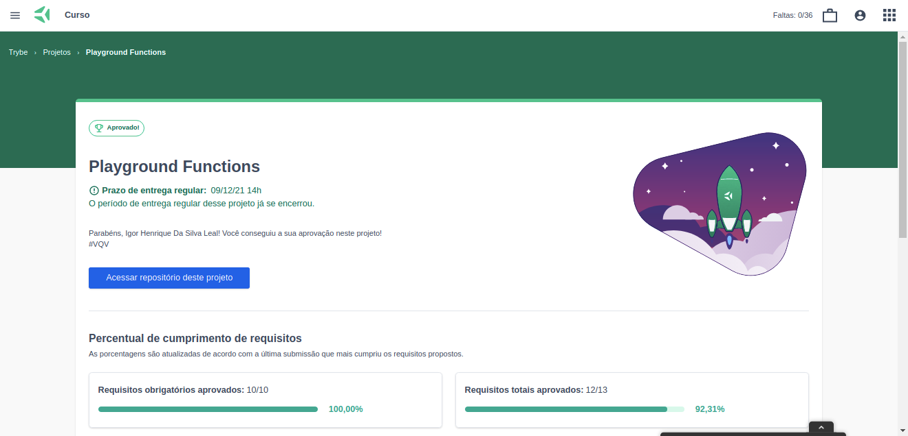

Esse é um projeto desenvolvido em JavaScript ao final do Bloco 4 do Módulo Fundamentos do curso de Desenvolvimento Web da [Trybe](https://www.betrybe.com/).
Concluí 100% dos requisitos obrigatórios e dois de três requisitos bônus.

O projeto consiste em:

- *Escrever códigos em JavaScript que usam variáveis e tipos primitivos;*

- *Utilizar conceitos da linguagem como a tipagem dinâmica e operadores lógicos/aritméticos/de atribuição no seu código;*

- *Criar códigos que usam estruturas condicionais, como o if/else;*

- *Manipular arrays (listas);*

- *Utilizar o comando for ;*

- *Quebrar grandes problemas em pequenos;*

- *Utilizar a lógica de programação na resolução de problemas;*

- *Manipular objetos;*

- *Utilizar o comando for/in;*

- *Utilizar funções para organizar e estruturar o seu código;*
